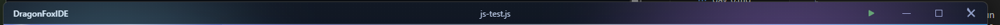
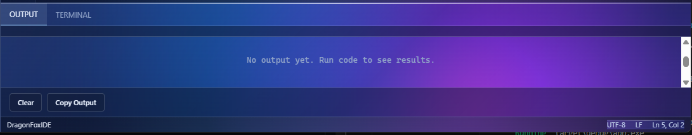
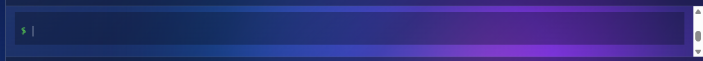
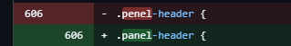

# DAY-13
Today was a Good day. and i was some bugs fixed and a new feature added.

## First Feature (Add Code Execution for rust and javascript and paython):

- Now you can compile and run your code in the terminal. That was inBuild but not powerfull level stell devlopment
- Added a new button in top bar to run the code.
- Running time that run button was rottating and color was reddish. and when code was runn completed it was stop.
- Execution time output was shown in output section in IDE

### This feature Some images:

Run button image:

OutPut Panel image:

Execution Time image:

## Second feature (Added a new Terminal) (terminal have some probm in UI: I Will fix later :)):

- Now you can open a terminal in the IDE.
- Terminal was you can run any Commands of Your Computer
- That terminal will help you to run your code and other commands.
- better shell
- cool terminal

### images:

Terminal image:

## Some Cool fixex :

#### typo fix:

I typed "penal-header" by mistake, which is why the CSS wasn't working on that element. I have fixed it now. That problem happens when I type too fast and don't pay enough attention. Hahaha!

Git hub image for the error:

#### auto close bracket writed in wrong place fixed

#### some css fix but i forgot about that :(

## Why i was added 2h in journel
becuase I was hard thinging and resercing and for adduing new Features. and the bugs are finding so hard probm. 
terminal and output panel so hard and debiging the code of it. it took 2h for me. but i will fix it and i will make it better.

Please consider my valuble 2h :)