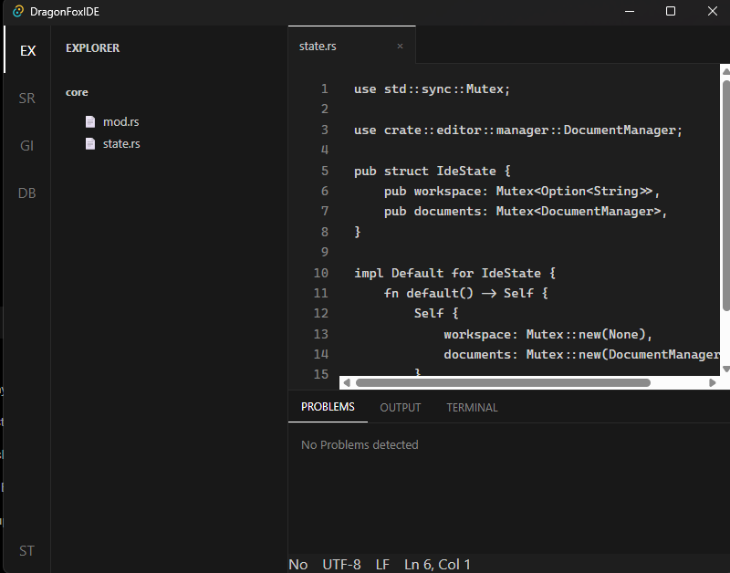
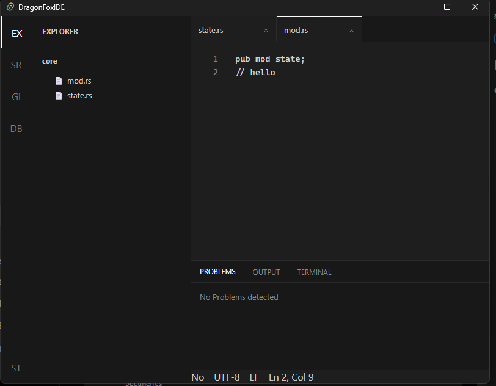

# DAY-3
Today i was added so many things to my IDE
features:
1. Save Document
2. Edit Document
3. add multi-tab editing
4. line numbers
5. cursor position

demo img current stage:

Researching phase is most important phase in my IDE
Today i spent clear 1h for reserch i was used reserching google, chatgpt. 

i liked chatgpt expllanation