# 6 7
This two days what i am added:

## 6 
Today is i used more Ai for coding that add new theme and making new glass theme. i get expected things but stell need that theme more improvement
 
This are the themes

dark:
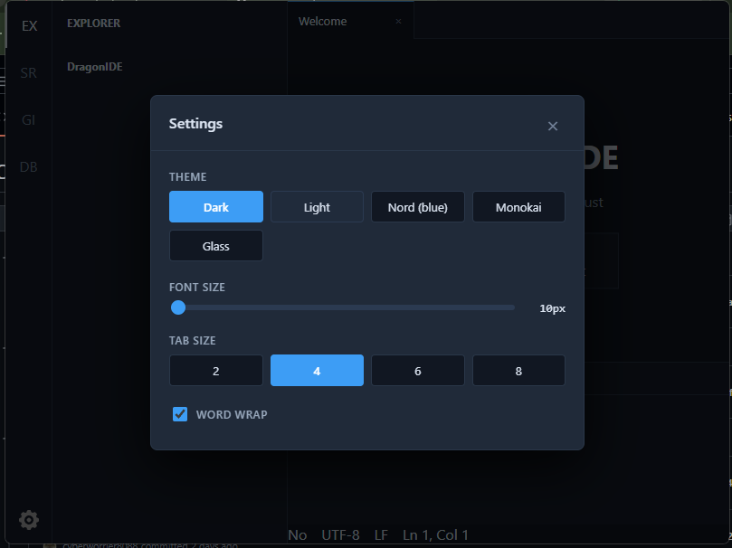
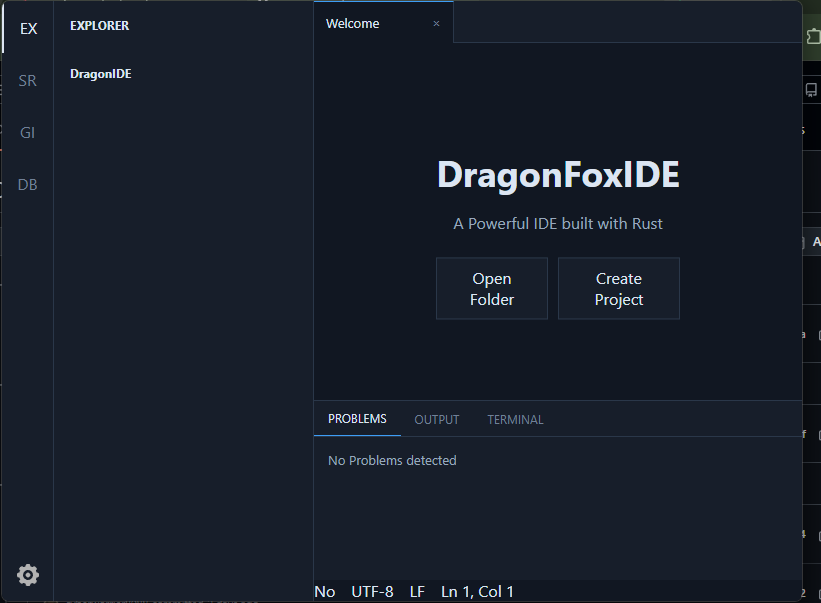
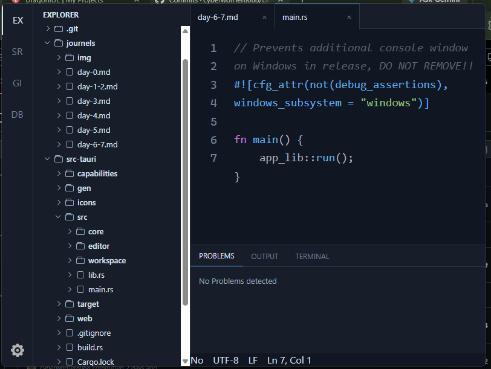

light:
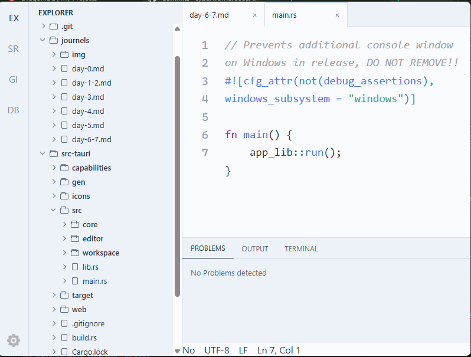
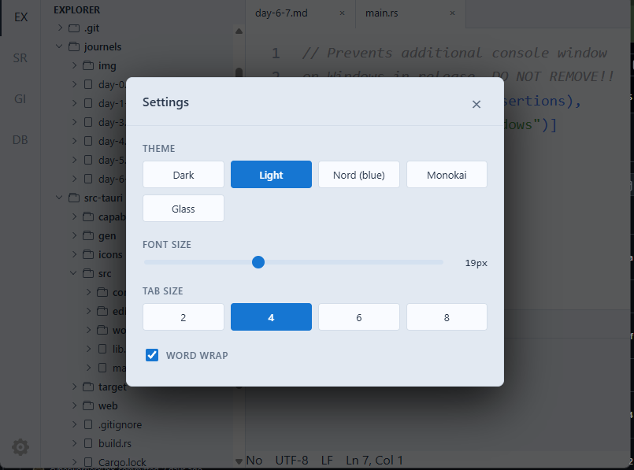
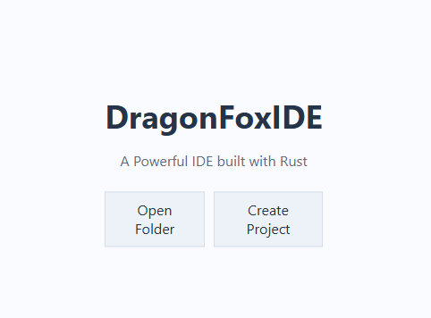

nord:
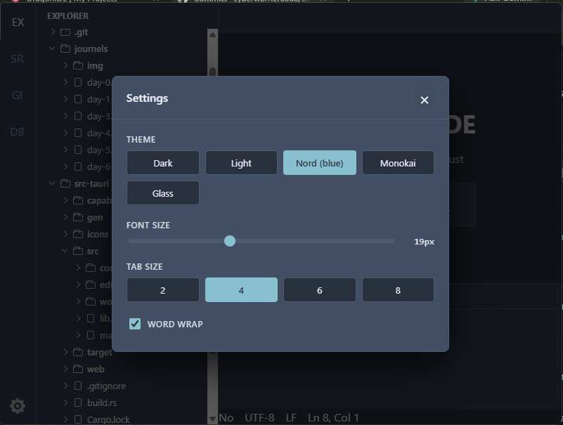
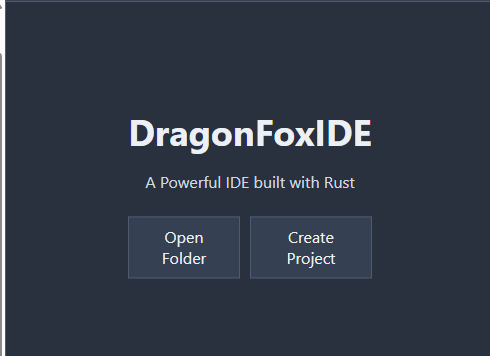
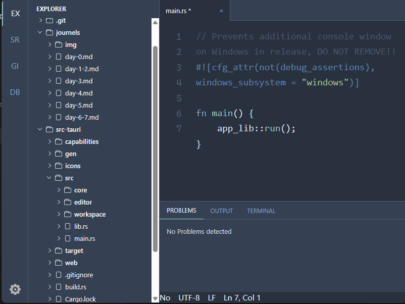

monokai:
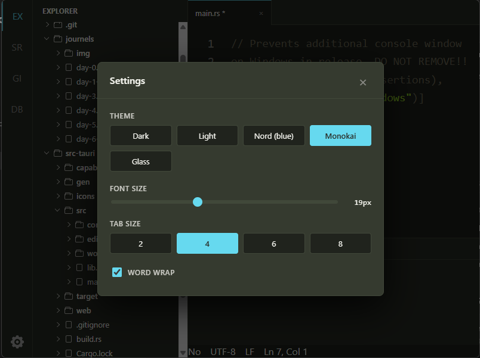
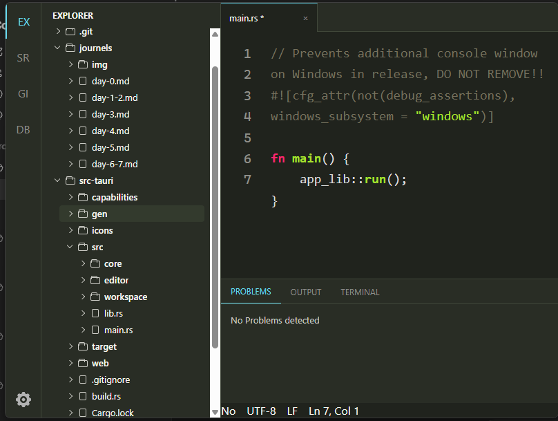
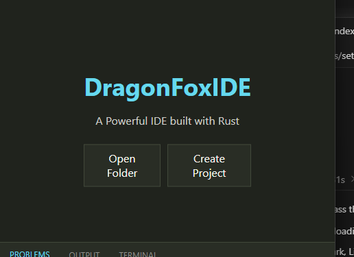

Glass theme is not fuly complitd i think last intruduce that theme :)

## 7
today i was added big thing

that was a custom title bar

from linux style to windows style i was changed to my own.

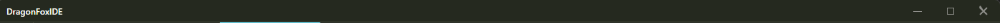