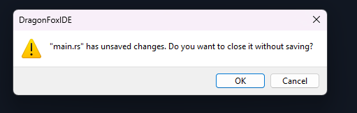
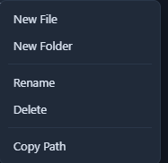

# DAY-8

Today was amazing.

I was worked on features:
- unsaved change prompt before clossing a file
- right click context menu for files and directories. 
    - copy path
    - rename
    - delete
    - new file
    - new folder

unsave file and close file you see

context menu you see
