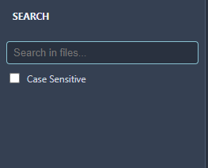
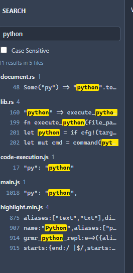

# DAY_14
today was a really good day. I added two new features and fixed a lot of bugs. Some of bugs were made by me while adding the feature. Hahhahah!

## First Feature (Stop button for running code):

- before this, if my code had an infinite loop (like 'loop {}' in Rust), it kept running forever and i could't run anything else until i closed the IDE.
- now a red **Stop** button shows up in the output panel while the code is running.
- pressing Ctrl+Alt+R again also stops the code.
- when i stop it, the output shows "Stopped after Xms" and status changes to STOPPED. When the code finishes normally, it shows Done :)

### images:

Stop button image:

Stopped output image:

## Second Feature (Search across files)

- The "SR" button in the activity bar was doing nothing for a long time. Now it has a search icon and its workisssss!
- Click it or press ctrl+shift+f to open the search panel.
- Typing any text and it searches evary file in the opened folder.
- Ruslts are grouped by file with line numbers, and the matched word is highlighted in yellowww.
- Click any result and the file opens at the exect line
- There is a case sensitive checkbox :)))
- The search runs in the background, so the IDE doesn't freeze while searching. It also waits 300ms after I stop typing, so it doesn't search on every key press.

### images:

Search panel image:

Search results image:

## Some cool fixes:

#### Run code was freezing the whole IDE

My rust commands for running code and the terminal where normal functions, runs normal commands on the main thread. So when I ran an infinite loop, the whole IDE froze. i made them 'async' and moved the work to background thread wih 'spawn_blocking'. Now the IDE stays smooth even when code runs for a long time 

#### Python and console window fixes on windows

- 'python3' doesn't exist on Windows, it's just 'python'. Fixed that.
- Every time I ran code, a black console window flashed for a moment. Fixed it with the 'CREATE_NO_WINDOW' flag.

Some problems come: I type too fast and dont check. hahahah

## Why i spent 2h

Becuase finding bugs was harder then adding features this time. most of the time went into understanding why Run was freezing the IDE and why the Stop button did nothing. Process IDs, background threads and killing a process on Windows were all new for me. The search feature was also tricky, because I had to skip the right folders and keep the UI fast.

But now running code feels safe, and search makes the IDE feel much more like a real IDE :))

Please consider my Valuble 2H :)